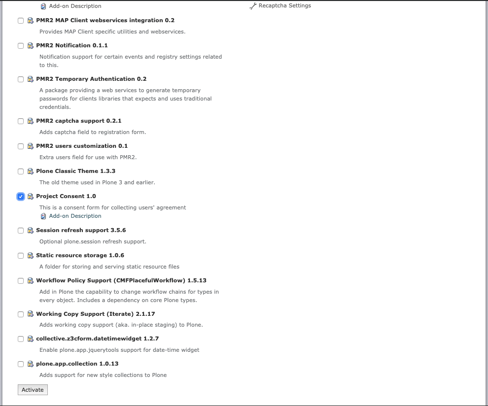
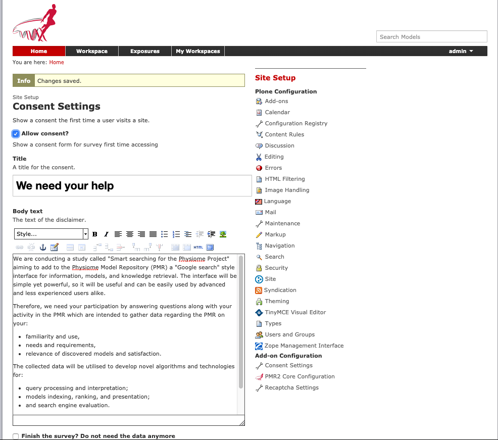
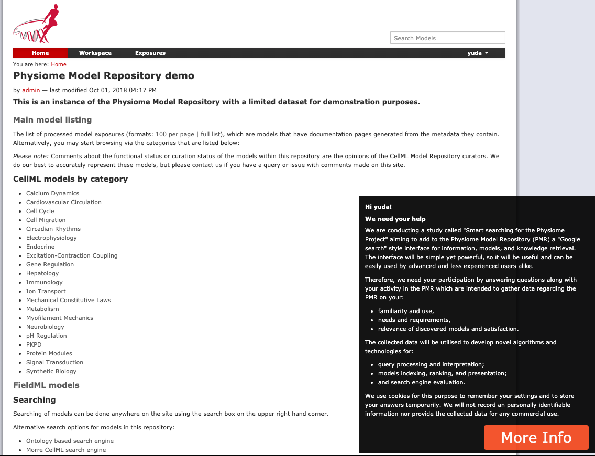
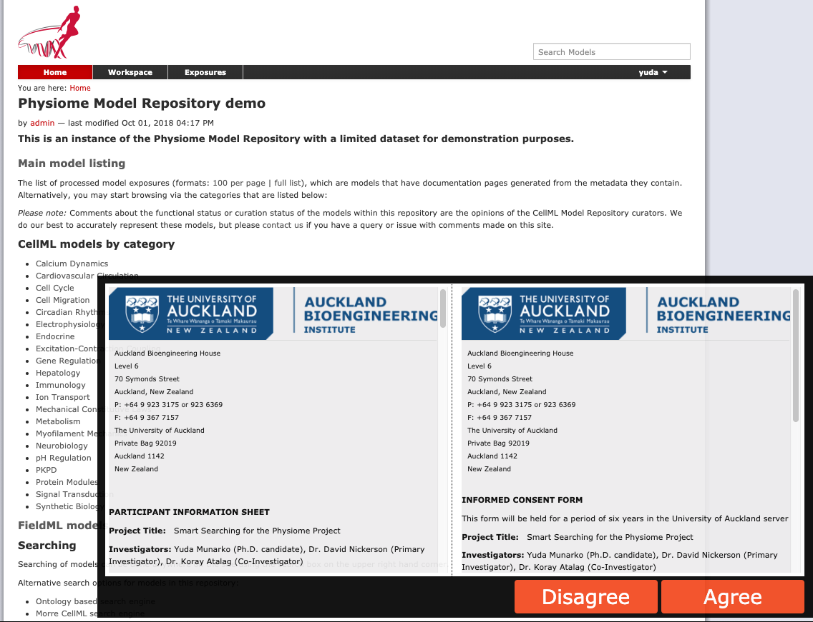
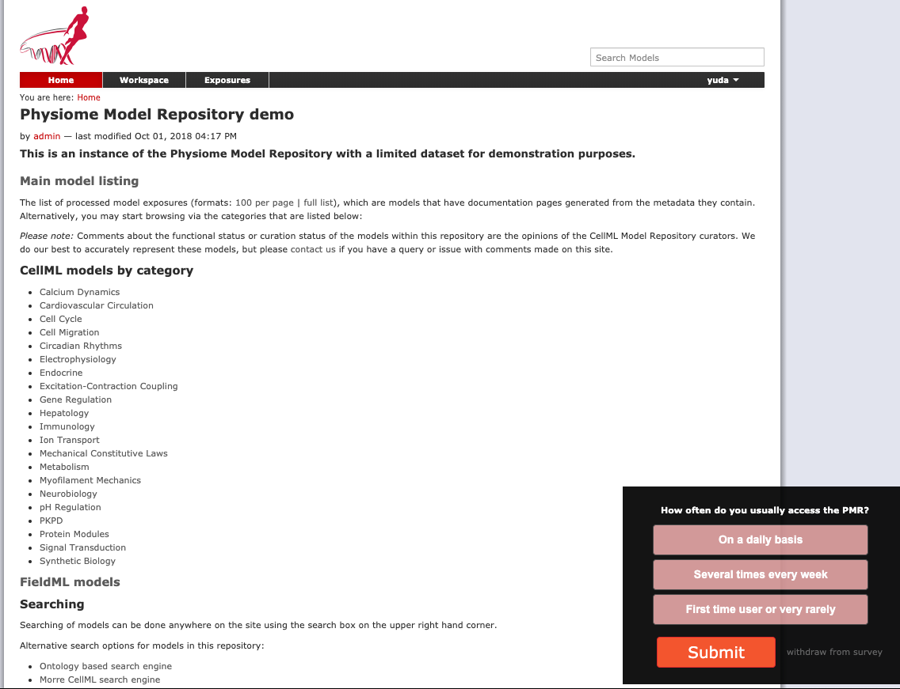
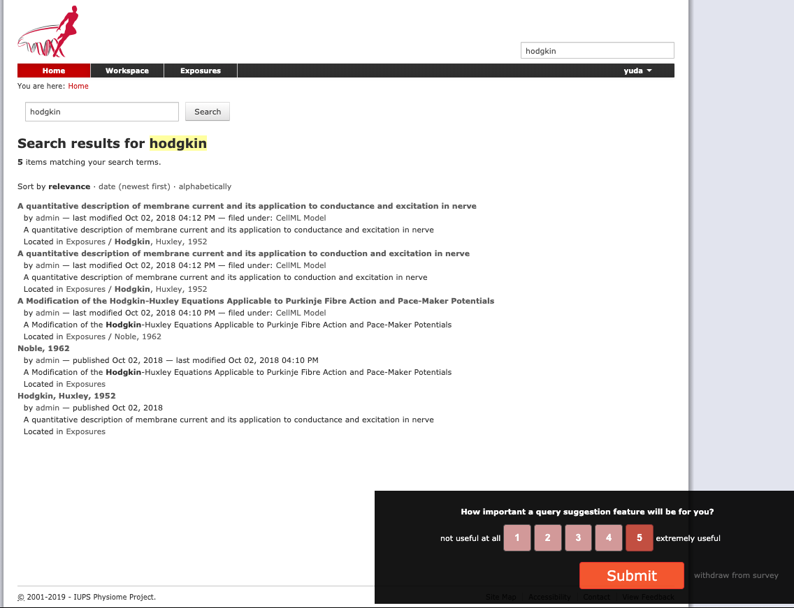
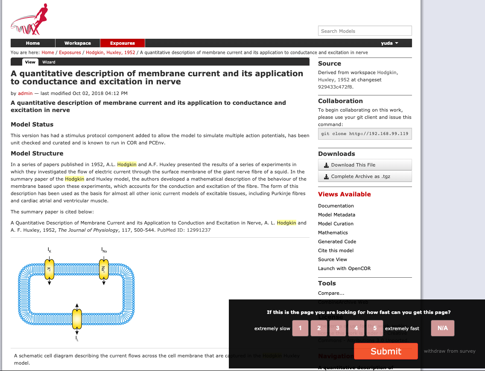
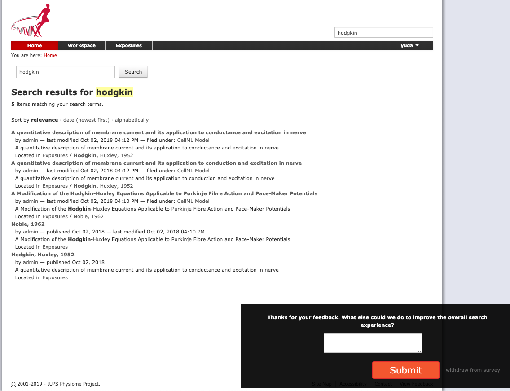
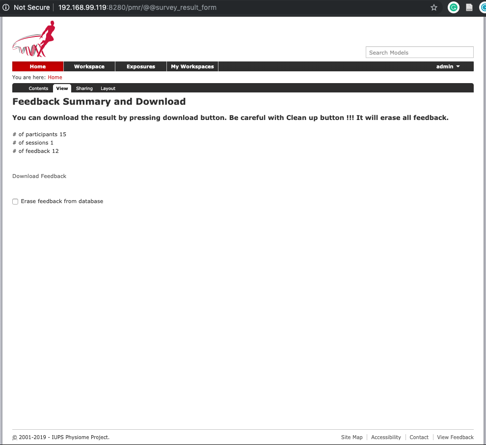
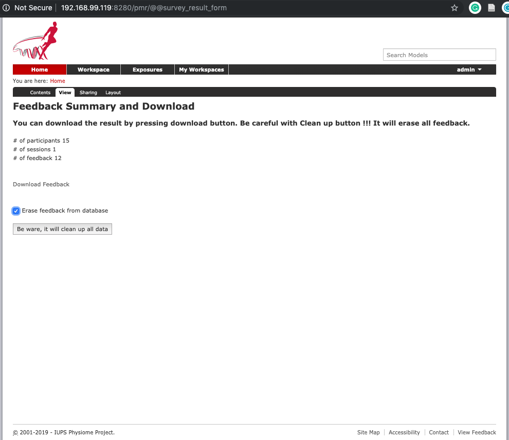

# nap.consent

This is the resouce of **nap.consent** add-on. The aim of this add-on is to conduct and manage a survey to collect information about the **Physiome Model Repository (PMR)** user perception and behaviour when searching for information regarding to biosimulation models.

Here, I will describe the add-on installation and activation process, and it's features.

## How it works
The survey works by utilising cookies and local storages. There are 9 cookies and 4 local storages that have functions:
- Manage user consent
- Temporarily stored user's answer. The answer, then, is send to the server by the next request.

User answers are manage in server using persistance object.

## Installation process
Installation step on the PMR:
 - Edit **buildout.cfg**, add this code inside the file
  ```
    develop = ${testing:develop}
        ...
        src/nap.consent

    ...
    ...

    eggs=
        ...
        nap.consent
  ```
 - Edit **deploy-all.cfg**, add this code inside the file
  ```
      develop =
        ...
        src/nap.consent
  ```
 - Build the add-on:
  ```
    # /etc/init.d/pmr2.zeoserver stop
    # /etc/init.d/pmr2.instance stop
    # bin/buildout
    # bin/buildout -c deploy-all.cfg
    # /etc/init.d/pmr2.zeoserver start
    # /etc/init.d/pmr2.instance start
  ```

## Activate the survey
 - Log in as admin, then access Site Setup page
 - Select the add-ons page
 - Activate **Project Consent 1.0**
   Select **Project Consent 1.0** and then activate it.
   
 - Configure the add-on by following **Consent Settings** link
 - Setting the add-on
   The most important action in this step is allowing the survey to be accessed by users. It can be done by selecting **Allow consent** checkbox and save it. You can also modify the title and content of survey's invite.
   

## Survey's consent

 - Invite
   

 - Participant Information Sheet and Informed Consent Form
   

## Questions appearance:
 - Multiple choices
   

 - Likert 1 until 5
   

 - Likert 1 until 5 and not available option
   

 - Textual question
   

## Accessing and deleting data:
 - Download survey results
    - Access @@survey_result_form
    - Press **Download Feedback** link
      
    - Example of downloaded data
      

 - Erase data from server
    - Be careful in this step, since the deleted data is not rediscoverable.
    - Select **Erase feedback from database** the press the button
    - Repeat this step severall time until the number of session and feedback is 0
      

## List of questions

### Measuring familiarity with the PMR and their usage.
1. How often do you usually access the PMR?
   - Type of question: Multiple choice.
   - Possible answers:
     - On a daily basis
     - Several times every week
     - First time user or very rarely
   - Direction:
     - Please select one answer.
     - Press the “Submit Answer” button.
2. I have a particular biomedical domain of interest (e.g. cardiovascular, gastrointestinal, immunology, etc)
   - Type of question: Likert scale 1.
   - Possible answer:
    - a number between 1 and 5.
   - Direction:
     - Please select a value between 1 (no interest) and 5 (strong interest)
     - Press the “Submit Answer” button.
3. I have a particular biophysical mechanism of interest (e.g. electrophysiology, ion transport, gene regulation, etc)
   - Type of question: Likert scale 1.
   - Possible answer:
     - a number between 1 and 5.
   - Direction:
     - Please select a value between 1 (no interest) and 5 (strong interest).
     - Press the “Submit Answer” button.

### Gathering user requirements
1. A concise informative snippet is needed for each model presented in the result list.
   - Type of question: Likert scale 2.
   - Possible answer:
     - a number between 1 and 5.
     - the question is not relevant
   - Direction:
     - Please select a value between 1 (strongly disagree) and 5 (strongly agree) or indicate the question is not relevant
     - Press the “Submit Answer” button.
2. What kind of information do you require to be presented by a snippet?
   - Type of question: Multiple selection.
   - Possible answer:
     - Biomedical domain
     - Biophysical mechanism
     - Anatomical location
     - Species
     - Tissue
     - Scale
     - Type of Maths
     - Other (specify)
   - Direction:
     - Please select one or more answer.
     - Press the “Submit Answer” button.
3. How important a query suggestion feature will be for you?
   - Type of question: Likert scale 1.
   - Possible answer:
     - a number between 1 and 5.
   - Direction:
     - Please select a value between 1 (not useful at all) and 5 (extremely useful)
     - Press the “Submit Answer” button.
4. How satisfied are you with the content of the results list?
   - Type of question: Likert scale 2.
   - Possible answer:
     - a number between 1 and 5.
     - the question is not relevant
   - Direction:
     - Please select a value between 1 (not satisfied at all) and 5 (extremely satisfied) or indicate the question is not relevant.
     - Press the “Submit Answer” button.
5. How satisfied are you with the presentation of the results list?
   - Type of question: Likert scale 2.
   - Possible answer:
     - a number between 1 and 5.
     - the question is not relevant
   - Direction:
     - Please select a value between 1 (not satisfied at all) and 5 (extremely satisfied) or indicate the question is not relevant.
     - Press the “Submit Answer” button.
6. Regarding your information needs which link on this page is the most suitable for you?
   - Type of question: Multiple choice.
   - Possible answer:
     - Documentation
     - Model Metadata
     - Model Curation
     - Mathematics
     - Generated Code
     - Cite this model
     - Source View
     - Other (specify)
   - Direction:
     - Please select one answer.
     - Press the “Submit Answer” button.
7. Regarding your information needs which part on this page is the most suitable for you?
   - Type of question: Multiple choice.
   - Possible answer:
     - Model Status
     - Model Structure
     - Schematic Diagram
     - Original Paper
     - Reference
     - Other (specify)
   - Direction:
     - Select one possible answer.
     - Press the “Submit Answer” button.
8. Thanks for your feedback. What else could we do to improve the overall search experience?
   - Type of question: short text.
   - Possible answer:
     - Suggestions about how to improve the overall search experience.
   - Direction:
     - Please type your suggestions about how to improve the overall search experience.
     - Please use a maximum of 100 characters.
     - Please do not put any personal information.
Press the “Submit Answer” button.

### Measuring user satisfaction and models relevancy
1. How relevant are the results to the information you are looking for?
   - Type of question: Likert scale 2.
   - Possible answer:
     - a number between 1 (not relevant at all) and 5 (extremely relevant).
     - the question is not relevant
   - Direction:
     - Please select a value between 1 (not relevant at all) and 5 (extremely relevant) or indicate the question is not relevant.
     - Press the “Submit Answer” button.
2. If this is the page you are looking for how fast can you get this page?
   - Type of question: Likert scale 2.
   - Possible answer:
     - a number between 1 and 5.
     - the question is not relevant
   - Direction:
     - Please select a value between 1 (extremely slow) and 5 (extremely fast) or indicate the question is not relevant.
     - Press the “Submit Answer” button.
3. If this is the page you are looking for how easy/intuitive was it to get to this page?
   - Type of question: Likert scale 2.
   - Possible answer:
     - a number between 1 and 5.
     - the question is not relevant
   - Direction:
     - Please select a value between 1 (extremely difficult) and 5 (extremely easy) or indicate the question is not relevant.
     - Press the “Submit Answer” button.
4. If you used the browse feature instead of searching how easy was is it to find information you were looking?
   - Type of question: Likert scale 2.
   - Possible answer:
     - a number between 1 (extremely difficult) and 5 (extremely easy).
     - the question is not relevant
   - Direction:
     - Please select a value between 1 and 5 or indicate the question is not relevant.
     - Press the “Submit Answer” button.
